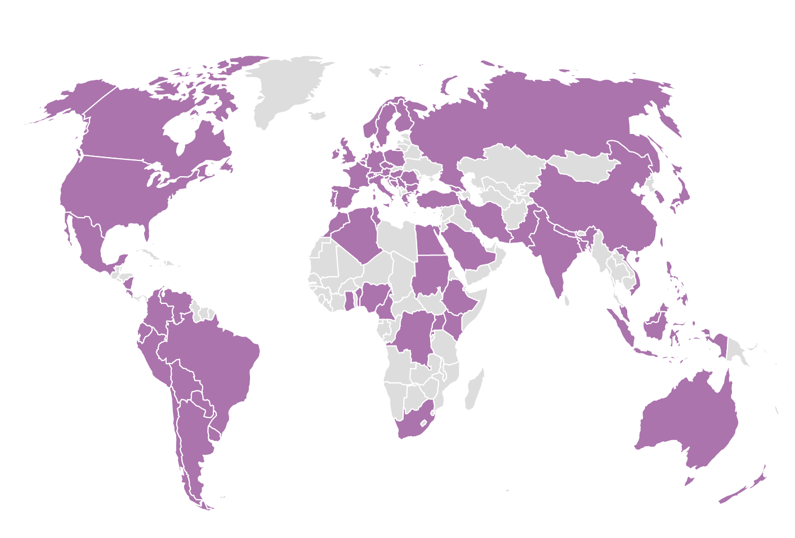

```{r setup, include = FALSE}
# loading libraries
library(tidyverse)
library(palmerpenguins)
library(fontawesome)

# preset code chunk options
knitr::opts_chunk$set(dpi = 300,            # ensures high resolution images
                      echo = FALSE,         # FALSE: code chunks don't show
                      warning = FALSE,      # FALSE: suppresses warning messages
                      error = FALSE)        # FALSE: Suppresses error messages
```

```{r meta, echo=FALSE}

library(metathis)
meta() %>%
  meta_general(
    description = "Shelby's xaringan template",
    generator = "xaringan"
  ) %>% 
  meta_name("github-repo" = "shelbybachman/xaringan-template") %>% 
  meta_social(
    title = "Shelby's xaringan template",
    url = "https://shelbybachman.github.io/xaringan-template/index.html#1",
    image = "",
    image_alt = "Title slide",
    og_type = "website",
    og_author = "Shelby Bachman",
    twitter_card_type = "summary_large_image",
    twitter_creator = "@shelbybachman"
  )
```

class: title-slide, middle, inverse
background-image: url(img/scott-webb-cactus.jpg)
background-position: bottom
background-size: cover

# `r rmarkdown::metadata$title`

.footnote[
Photo by [Scott Webb](https://unsplash.com/@scottwebb)
]

---
class: inverse, middle, center

# An inverse slide


???
Hello! My name is R-Ladies Global and I'm excited to be here to help promote gender diversity in the R community.

If you like this R-Ladies themed xaringan template, you can copy it to your computer: **usethis::use_course("spcanelon/RLadies-xaringan-template")**

And learn how to deploy xaringan slides to GitHub Pages in this blog post:<br> [silvia.rbind.io/2021-03-16-deploying-xaringan-slides](https://silvia.rbind.io/2021-03-16-deploying-xaringan-slides)

???
This slide uses:
- the `inverse`, `middle`, and `center` slide classes
- an image inserted with html

---
class: center, middle

# Slide with centered content in middle

Centered and in the middle of the slide

.left[Some text on the left...]

.right[and more on the right!]

---

# Slide with content split left and right

.pull-left[Left column]

.pull-right[Right column]

---

.left-column[
# Slide header
]

.right-column[

## Description

Some text here.


.footnote[

----
A footer: https://rladies.org/about-us]
]

???
This slide uses:
- the `.left-column[]` and `.right-column[]` classes
- a horizontal bar
- the `.footnote[]` class

---
# Making lists and emphasizing text

--

The R-Ladies Community has:

--

* 85,144 members

--

* Across 56 countries

--

* and 198 chapters worldwide

--


-----

And with the help of Markdown you can write text in **bold** and _italics_

--

1. And make numbered lists
1. like this one

.footnote[
These numbers come from the [Shiny R Community Explorer](https://benubah.github.io/r-community-explorer/rladies.html) developed by Ben Ubah
]

???
This slide uses:
- bullet list with `*`
- incremental slides divided by `--`
- numbered list with `1.`
- a horizontal bar
- the `.footnote[]` class

---
# Inserting images

```{r, echo = TRUE, fig.alt="World map with countries that have R-Ladies chapters highlighted in purple"}

```

--

> Note: You can use the `fig.alt` code chunk option to add alternative text to your images, that way they are accessible to screen reader users:
- In code chunk: `{r, fig.alt = "<descriptive alt text>"}`.
- Read more about this in [{knitr} NEWS.md](https://github.com/yihui/knitr/blob/master/NEWS.md#new-features-1)

???
This slide uses:
- an image inserted with `knitr::include_graphics()`
- the `fig.alt =` code chunk option for alternative text

---
# Tables and quotes

### Table

.pull-left[

`palmerpenguins::penguins`

The `penguins` dataset contains size measurements for adult penguins nesting near Palmer Station in Antarctica.

Measurements like `body_mass_g`
]

.pull-right[

```{r}
palmerpenguins::penguins %>%
  select(species, island, body_mass_g) %>%
  arrange(body_mass_g) %>%
  head() %>%
  knitr::kable(format = 'html')
```
]

???
This slide uses:
- the `.pull-left[]` and `.pull-right[]` classes
- an R code chunk to produce the html table

--

### Quote

> You can read more about the `palmerpenguins` data package authored and maintained by Allison Horst at [allisonhorst.github.io/palmerpenguins](https://allisonhorst.github.io/palmerpenguins/)

???
- a quote with `>`

---
# Highlighting code

`> This is what inline code looks like`

You can highlight lines of code within code chunks using `#<<`:

### Code

```r
palmerpenguins::penguins %>%
  ggplot(aes(x = island, y = body_mass_g)) +
  geom_boxplot(aes(fill = island))               #<<
```

### Output

```{r eval=FALSE, echo=TRUE}
palmerpenguins::penguins %>%
  ggplot(aes(x = species, y = body_mass_g)) +
  geom_boxplot(aes(fill = island))               #<<
```

???
This slide uses:
- inline code highlighting with backticks ` `` `
- a code chunk to produce a ggplot

---

```{r penguin-body-mass, eval=TRUE, echo=TRUE, fig.height = 4.5}
palmerpenguins::penguins %>%
  ggplot(aes(x = species, y = body_mass_g)) +
  geom_boxplot(aes(fill = island))               
```

???
This slide uses:
- a code chunk to produce a ggplot
- code chunk option `fig.height = 4.5` to control the figure height

---
class: inverse, title-slide
background-image: url(img/scott-webb-cactus.jpg)
background-position: bottom
background-size: cover

.pull-left[
# Thank you!
<br><br><br><br><br><br><br>
[`r fontawesome::fa("link", fill = "#6F9283")` shelbybachman.github.io](https://shelbybachman.github.io)<br/>
[`r fontawesome::fa("twitter", fill = "#6F9283")` @shelbybachman](https://twitter.com/shelbybachman)<br/>
[`r fontawesome::fa("paper-plane", fill = "#6F9283")` sbachman [at] usc [at] edu](sbachman [at] usc [dot] edu)<br>
]
